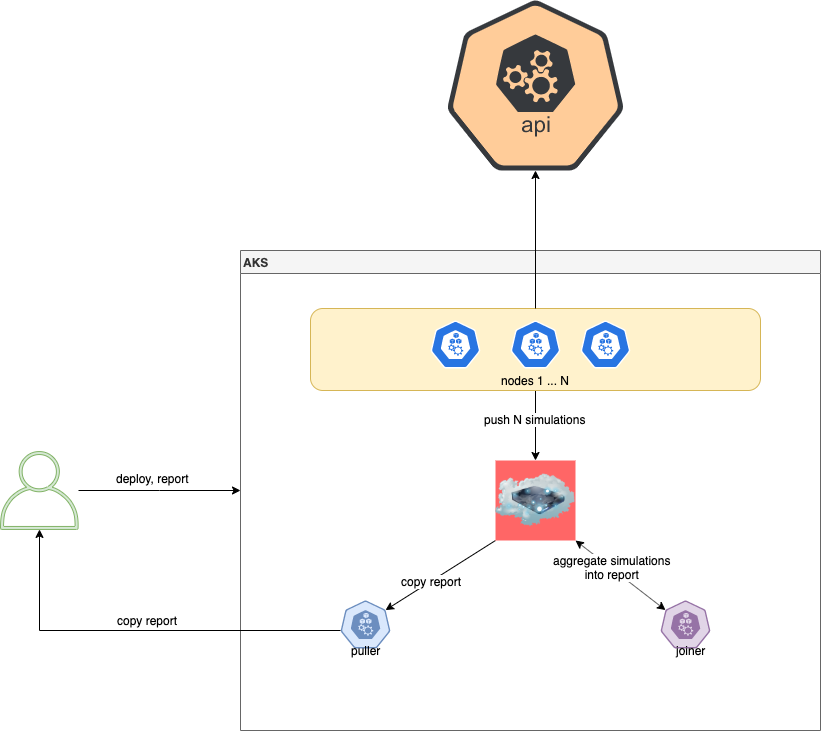
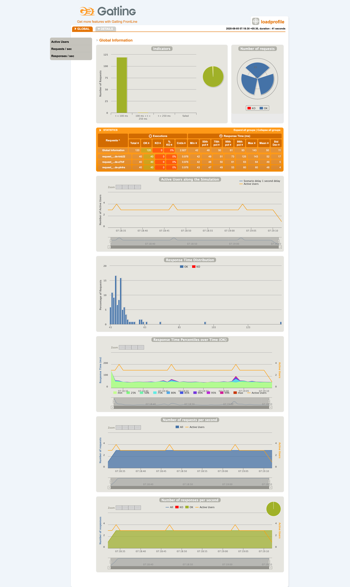

### Requirements

* kubectl
* Azure AKS 

### Usage

```
$ ./run.sh
Usage: ./run.sh load_profile build_flag deploy_flag report_flag cleanup_flag
```
Example
$ ./run.sh loadprofile false true true false  

 


### Build
$ ./run.sh loadprofile true false false false

```
$./run.sh loadprofile true false false false
Setting node and joiner gatling memories as 75% of max available memory
Gatling node maximum memory is 1536M MB
Gatling joiner maximum memory is 7680M MB
Wed Aug 5 07:10:59 IST 2020   ######################################## build and push docker images ################################################
Make sure you are logged into docker host

Wed Aug 5 07:10:59 IST 2020   #### build and push of gatlingnode image ###
sha256:af3c51547f1fef1fda60134b259f32798850d0e9281d523043467acef6539c22
The push refers to repository [registry.hub.docker.com/jibijose/gatlingnode]
a0be7dfd7f40: Layer already exists 
...
f2cb0ecef392: Layer already exists 
latest: digest: sha256:a24e19a0eeb06f872e1722238f3ee90184a1a2cbf7c6cae29ff993fdb2a45230 size: 1580

Wed Aug 5 07:11:12 IST 2020   #### build and push of gatlingjoiner image ###
sha256:cb4a7f50aec08139b355382edbc74dbd7af61c7a47911c232a3d16f18dc9cce8
The push refers to repository [registry.hub.docker.com/jibijose/gatlingjoiner]
a464312e3938: Layer already exists 
...
f2cb0ecef392: Layer already exists 
latest: digest: sha256:d947b4c9bf4a97740cba14cd667afb87efb90f98110440d232a2dbf6135e6dae size: 1580
```

### Deploy
$ ./run.sh loadprofile false true false false

```
$ ./run.sh loadprofile false true false false
Setting node and joiner gatling memories as 75% of max available memory
Gatling node maximum memory is 1536M MB
Gatling joiner maximum memory is 7680M MB
Wed Aug 5 07:16:52 IST 2020   ######################################## deploy k8s configmaps #######################################################
Make sure you are connected to kubectl
namespace "gatlingcluster-loadprofile" deleted
namespace/gatlingcluster-loadprofile created

Wed Aug 5 07:17:49 IST 2020   #### Creation of configmap   ###
configmap/loadprofile created
Wed Aug 5 07:17:51 IST 2020   ######################################## deploy k8s ##################################################################
Wed Aug 5 07:17:52 IST 2020   #### Applying kubernetes yaml into namespace gatlingcluster-loadprofile ###
storageclass.storage.k8s.io/my-azurefile unchanged
persistentvolumeclaim/my-azurefile created
job.batch/gatlingnode created
job.batch/gatlingjoiner created
pod/gatlingpuller created
```

### Report
$ ./run.sh loadprofile false false true false

```
$ ./run.sh loadprofile false false true false
Setting node and joiner gatling memories as 75% of max available memory
Gatling node maximum memory is 1536M MB
Gatling joiner maximum memory is 7680M MB
Wed Aug 5 07:25:01 IST 2020   ######################################## copy combined gatling report ################################################
Wed Aug 5 07:25:01 IST 2020   #### Waiting for reports ###
gatling joiner pod is not running or not completed. Waiting...
gatling joined pod gatlingjoiner-hzlkn
Wed Aug 5 07:25:14 IST 2020   Waiting for report generation...
...
Wed Aug 5 07:26:45 IST 2020   Waiting for report generation...
Report generated. Continuing...

Wed Aug 5 07:26:58 IST 2020   #### Copying reports to local ###
tar: removing leading '/' from member names

Wed Aug 5 07:27:03 IST 2020   #### Opening reports ###
```  

 
### Cleanup
$ ./run.sh loadprofile false false false true

```
Setting node and joiner gatling memories as 75% of max available memory
Gatling node maximum memory is 1536M MB
Gatling joiner maximum memory is 7680M MB
Wed Aug 5 07:31:32 IST 2020   ######################################## cleanup #####################################################################

Wed Aug 5 07:31:32 IST 2020   #### Kubectl cleanup ###
warning: deleting cluster-scoped resources, not scoped to the provided namespace
storageclass.storage.k8s.io "my-azurefile" deleted
persistentvolumeclaim "my-azurefile" deleted
job.batch "gatlingnode" deleted
job.batch "gatlingjoiner" deleted
pod "gatlingpuller" deleted
configmap "loadprofile" deleted
namespace "gatlingcluster-loadprofile" deleted
```

### TODOs  